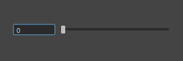
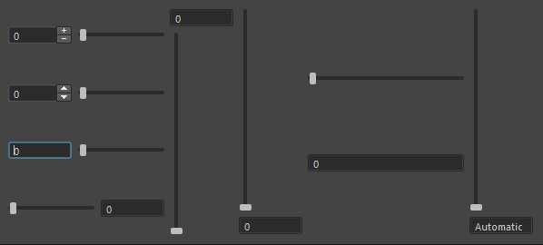

# QtUn
QtUn provides custom classes based on PySide2  

## QtUnWidgets
QtUnWidgets provides custom QtWidgets classes based on PySide2  

### QIntSlider
  
The QIntSlider widget is a widget that displays an int SpinBox and Slider.  
#### Slots:
- setRange(min, max)  
- setValue(value)  
- setDirection(direction)  
- setOrientation(orientation)  
- setValue(value)  
  
#### Signals:  
- actionTriggered(action)  
- rangeChanged(min, max)  
- sliderMoved(value)  
- sliderPressed()  
- sliderReleased()  
- valueChanged(value)  

  
QIntSlider Can be flexibly customized for ease of use.
